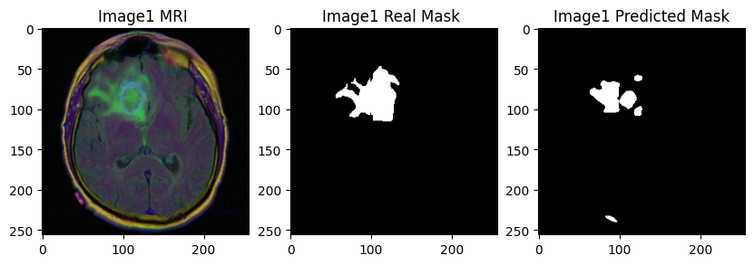
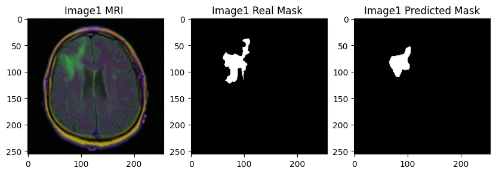
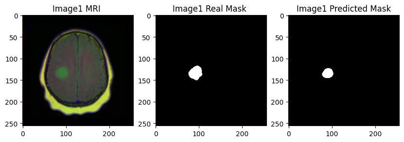
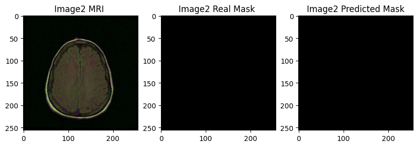

# Brain Tumor Segmentation

## Overview

This project implements **brain tumor segmentation** using MRI scans with two architectures:

- **U-Net**
- **U-Net with VGG16 encoder**

The models are trained and evaluated on the **LGG Segmentation Dataset**, leveraging advanced loss functions and metrics tailored for medical imaging challenges such as class imbalance and precise boundary delineation.

---

## Dataset

- **Source**: [LGG Segmentation Dataset on Kaggle](https://www.kaggle.com/datasets/mateuszbuda/lgg-mri-segmentation)
- **Size**: 3,929 MRI slices with corresponding binary masks.
- **Format**: TIFF files for high-quality image preservation.
- **Details**: Each MRI scan is paired with a binary mask indicating tumor regions.

---

## Model Architectures

### U-Net

A convolutional neural network designed for segmentation tasks:

- **Encoder**: Captures spatial features through convolutional and pooling layers.
- **Decoder**: Reconstructs segmentation maps with skip connections to retain spatial details.
- **Output**: Binary mask predicting tumor regions pixel-by-pixel.

### U-Net with VGG16 Encoder

An enhanced U-Net model using **VGG16** pretrained layers:

- **Encoder**: Utilizes VGG16 blocks for robust feature extraction.
- **Decoder**: Reconstructs detailed masks with transposed convolutions and skip connections.
- **Output**: Pixel-wise binary probabilities of tumor presence.

---

## Training Details

- **Framework**: PyTorch
- **Preprocessing**:
  - Resize all images and masks to **256x256**.
  - Augmentation using Albumentations: flipping, rotation, brightness adjustment, and Gaussian noise.
- **Data Splitting**: 80% for training, 20% for testing.
- **Batch Size**: 16
- **Optimizer**: Adam with a learning rate of **0.0001**.
- **Scheduler**: ReduceLROnPlateau for dynamic learning rate adjustments.
- **Loss Functions**:
  1. **BCE + Dice Loss**: Balances pixel-level accuracy with region overlap.
  2. **Tversky Loss**: Reduces false positives with customizable weights for imbalanced segmentation.

---

## Results Summary

| Model         | Loss Function   | Dice Score | Tversky Index |
| ------------- | --------------- | ---------- | ------------- |
| U-Net         | BCE + Dice Loss | 0.7034     |               |
| U-Net         | Tversky Loss    | 0.6959     | 0.7168        |
| U-Net + VGG16 | BCE + Dice Loss | 0.6934     | 0.7083        |
| U-Net + VGG16 | Tversky Loss    | 0.6996     | 0.7175        |

---

## Visualization

The repository includes visual results showcasing the following as an image, which is also included in the repository:
|  |  |
|:-------------------------------------------------------------------------:|:-------------------------------------------------------------------------:|
| **Example 1** | **Example 2** |

|  |  |
| :--------------------------------------------------------------------------: | :--------------------------------------------------------------------------: |
|                                **Example 3**                                 |                                **Example 4**                                 |

These demonstrate the models’ capability to identify tumor regions accurately while highlighting areas for further refinement.

---

## Usage

### Notebooks in Repository

All training, testing, and visualization for this project are contained within the individual Jupyter notebooks included in this repository. Each notebook contains the code for a specific model, including:

- Training.
- Testing.
- Visualizing results.

Notebooks included:

- `unet-bce+dice-loss.ipynb`
- `unet-tversky-loss.ipynb`
- `unet-vgg16-bce-dice-loss.ipynb`
- `unet-vgg16-tversky-loss.ipynb`

---

## Authors

- **Bouskine Othmane**
- **Boulaalam Yassine**

### Supervisor

- **Prof. Belcaid Anass**

### University

The National School of Applied Sciences of Tetouan, University Abdelmalek Essaâdi

---
